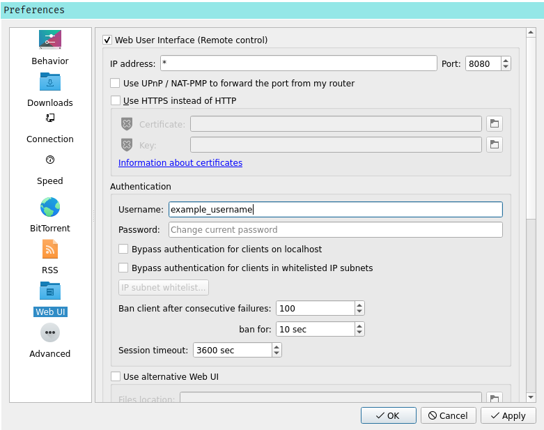

# Cinema in the Terminal

### Author: Isaac Lee

## Introduction

Search for and download films right from your terminal!

CineTerm is (sort of) TUI app which allows users to fuzzy search for films  (using the amazing [**fzf**](https://github.com/junegunn/fzf) fuzzy finding tool) and then download (torrent) them using the qbittorrent client. 

Sequential downloading is used so that when a film reaches 5% download it is opened
automatically in the mpv video player.  
This allows users to stream films without waiting to fully download.

## Features

A user can fuzzy search for **any** film from the YTS database, which has most films ever released!

Then once a film has been selected you have the following options:

| Option         | Description                                                  |
| -------------- | ------------------------------------------------------------ |
| (**s**)tream    | Stream the movie, i.e sequentially download and open in mpv with the option to delete after viewing. |
| (**d**)ownload | Download the movie.                                          |
| (**S**)peak    | Read the summary with text to speech.                        |
| (**t**)railer  | Open the YouTube trailer in mpv (uses youtube-dl).           |

## How it works

Two APIs are used: YTS Movie API and qbittorrent Web API.

1.  When we first run the application we send many (asynchronous) requests to the YTS movie
   database to get information for **all** of the ~ 42,000 movies in their database.
2. We then use pandas to store all this info in a dataframe and export to a pickle file which 
   can be read in very quickly and is compact in size.
3. When the app starts this dataframe is read in and then passed to [**fzf**](https://github.com/junegunn/fzf) which is a fuzzy finding tool.
4. Then when a movie is selected we get its id and then send a single request again to YTS
   to get the torrent, trailer, runtime, rating and summary information.
5. Then it's over to the qbittorrent api. If qbittorrent is not open, it is opened and the selected torrent is added and set to sequential download so that it can be opened when it is only partially downloaded.
6. Once the file reaches around 5% download, it is opened in mpv.
   **Caveat:** Using this method means whilst the movie is not fully downloaded, the user cannot
   skip ahead too far, because that part of the movie hasn't been downloaded yet.


## Installation

### Supported Systems

Currently only Linux based systems are supported. 
I do have plans to port to MacOS but probably won't bother with windows.

### Clone the Repo

```shell
git clone https://github.com/isaacjeffersonlee/CineTerm
```

#### Applications

Several applications are required:

```
sudo apt install sudo apt install qbittorrent mpv vlc fzf youtube-dl espeak
```

### Qbittorrent Setup

Once qbittorrent is installed, we need to get the web API key. On the top bar under 

*Tools*  > *Preferences* tick the Web User Interface (Remote control) option and then add a Username and Password, then click apply.
Also make sure Port is set to 8080. (This should be the default).



### Install Script

This repo comes with an optional install script.
Currently this only works for Debian and Arch based systems.

If more people end up using this I may add more distro/MacOS support.

The install script will install the required applications and necessary python requirements.

**Caution**: Ensure you activate any virtual env you want to use before running the install 
script, otherwise all the dependencies will be installed system wide. (Which you could possible want).

First cd into the CineTerm where install.sh is located and then give executable permissions:

```sh
cd CineTerm && chmod +x install.sh
```

Then run install.sh:

```sh
./install.sh
```

### Requirements

#### Python Packages

All python requirements can be found in [requirements.txt](https://github.com/isaacjeffersonlee/CineTerm/blob/master/requirements.txt) you can either use the install script
or you can run:

```shell
pip install -r requirements.txt
```

### Running

Once everything is installed, you can run the app with:

```shell
cineterm (--args)
```

Or alternatively, if installed in a virtual env, you something like:
```shell
alias cineterm='/home/isaac/.virtualenvs/cine_env/bin/python3 -m cineterm.app --vpn'
```
to your .zshrc/.bashrc etc. Where cine_env is the name of the venv where cineterm
is installed to.

### Optional Arguments

```
optional arguments:
  -h, --help            show this help message and exit
  -d DOWNLOAD_DIR, --download-dir DOWNLOAD_DIR
                        Path of directory to download films to.
  -v, --vpn             Call activate_vpn.sh on startup.
  -b BUFFER_PERCENT, --buffer-percent BUFFER_PERCENT
                        Percentage to download file before opening.
                        Recommended is 0.05
```

### VPNs

**Caution:** As with all torrenting, make sure you have a VPN activated before running the application.
Depending on your Internet Service Provider, this app may not work without one because YTS is often blocked.

Within the repo there is an activate_vpn.sh script. Add whatever command you use to activate your vpn here and then it will get activated on launch when you pass the `-v` or `--vpn` flag. i.e

```
python -m cineterm.app --vpn
```
